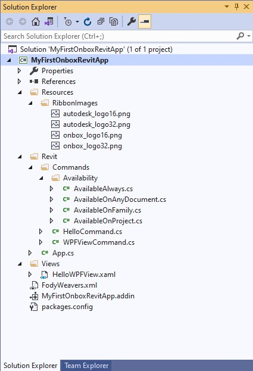
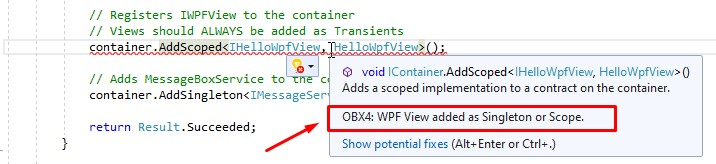

# Application

Congratulations! You have finished building your [first app](1_guetstart.md) using Onbox Framework, it may not seem like much but there are a lot of things happening in the background; Ribbon UI built, IOC Container being built and resolving references, Some wiring happening to get the WPF hooked to Revit and much more! Let's have a closer look:

## Exploring Solution Explorer Files

1. Back to Visual Studio, and expanding **"Solution Explorer"** we will find a bunch of files created by the Project Template that we have selected.



📢 The App and Command templates include a post build script to copy the app manifest and build results directly to the targeted Revit version, ProgramData folder. If you don't like this behavior, simply delete the script by right clicking your **Project -> Properties -> Post Build Events** and delete the entire **Post-build event command line** text.

## Exploring the App Class

1. Double click on **App.cs** to open the code file.

App.cs is the entry point of our application, here you will also define the lifecycle hooks for creating the app and integrating it with Revit. If you are used to Revit API programming this will look somewhat familiar to you, but some changes are evident. Notice that we derive from `RevitApp` base class, not `IExternalApplication`. This adds functionality to our application and uses the `ContainerProvider` class to unique identify the container context from other applications.

The implementations are ommited to better fit this documentation.

   ``` C#
    [ContainerProvider("12566691-949c-4ab8-a64d-a67991adbe93")] // This is generated when you create the VS project
    public class App : RevitApp
    {
        public override void OnCreateRibbon(IRibbonManager ribbonManager)
        {
            // Here you can create Ribbon tabs, panels and buttons
            ...Rest of method implementation
        }

        public override Result OnStartup(IContainer container, UIControlledApplication application)
        {
            // Here you can add all necessary dependencies to the container
            ...Rest of method implementation
        }

        public override Result OnShutdown(IContainerResolver container, UIControlledApplication application)
        {
            // No Need to cleanup the Container, the framework will do it for you
            return Result.Succeeded;
        }
    }
   ```

`OnCreateRibbon` passes in a `IRibbonManager` interface. This manager is used to, as the name suggest, create Ribbon tabs, panels, buttons, etc. The method itself is used to separate the logic of UI than actually doing container logic.

The biggest benefic here is to use cleaner code (less code too) to compose the Ribbon, most of the code is self explanatory, and you can hover over the method calls to see exactly what they are passing on. Also notice that `"onbox_logo"` and `"autodesk_logo"` refer to the Rescoures/RibbonImages folder on our project. Onbox uses convention base image size to button backgrounds, when you pass in `"autodesk_logo"` as an argument, the `IRibbonManager` implementation will try to find a resource called *autodesk_logo16.png"* and *"autodesk_logo32.png"* as background resources images for that button.


``` C#
        public override void OnCreateRibbon(IRibbonManager ribbonManager)
        {
            // Here you can create Ribbon tabs, panels and buttons
            var br = ribbonManager.GetLineBreak();

            // Adds a Ribbon Panel to the Addins tab
            var addinPanelManager = ribbonManager.CreatePanel("MyFirstOnboxRevitApp");
            addinPanelManager.AddPushButton<HelloCommand, AvailableOnProject>($"Hello{br}Framework", "onbox_logo");

            // Adds a new Ribbon Tab with a new Panel
            var panelManager = ribbonManager.CreatePanel("MyFirstOnboxRevitApp", "Hello Panel");
            panelManager.AddPushButton<HelloCommand, AvailableOnProject>($"Hello{br}Framework", "onbox_logo");
            panelManager.AddPushButton<WPFViewCommand, AvailableOnProject>($"Hello{br}WPF", "autodesk_logo");
        }
```

✔️ Having the ability to strong type Command and CommandAvailability is also very cool. Visual Studio will help you rename and navigate from Commands to their respective App!


`OnStartup` is where the framework injects its IOC container for the first time, here you have the ability to add all the necessary container logic.

``` C#
        public override Result OnStartup(IContainer container, UIControlledApplication application)
        {
            // Here you can add all necessary dependencies to the container
            container.AddOnboxCore();
            container.AddRevitMvc();

            // Registers IWPFView to the container
            // Views should ALWAYS be added as Transients
            container.AddTransient<IHelloWpfView, HelloWpfView>();

            // Adds MessageBoxService to the container
            container.AddSingleton<IMessageService, MessageBoxService>();

            return Result.Succeeded;
        }
```

If you are not familiar with the Inversion of control principle or IOC Containers, please have a look on this [article](https://martinfowler.com/articles/injection.html) or this [video](https://www.youtube.com/watch?v=QtDTfn8YxXg&), this is a very important concept for Onbox, it extensively uses this container throughout its libraries. Most of the work is done by the framework in the background, but it is good to know the advantages as it also changes the way you architecture you application and classes.

`container.AddOnboxCore` method call will add important core classes for dealing with Http requests, serialization, logging, mapping, and cloning of objects.

`container.AddRevitMvc` method call is adding UI/MVC support for the app, things like progress indicators, messaging service and navigation for WPF components.

`container.AddTransient<IHelloWpfView, HelloWpfView>` is adding that HelloWpfView that we opened previously, to the container. Notice that this is mapping an IHelloWpfView to abstract the interface to the actual View (Window) implementation, this is crucial for modularity and testability.

> ⚠️ **Heads Up:** Notice too that we are adding `HelloWpfView` as Transient, which means that the container will instantiate a new View everytime it is requested to resolve that View. WPF will throw an exception if you try to open the same instance of the view more than once, Onbox uses a Visual Studio Analyzer to help you not to make that mistake.

The image below shows the Analyzer complaining about registering a View as Scoped:




`container.AddSingleton<IMessageService, MessageBoxService>` is overwriting the previous registration that happened on the call to `container.AddOnboxCore`. It is adding the implementation of `IMessagedService`, now, as an actual dialog box using `MessageBoxService` as opose to debug logs using `MessageDebugService`. Onbox container will work as last-one-wins, so registering the later class implementations will overwrite previous ones.

## Conclusion

The flow shown above is nothing really new, the ideas of application lifecycle, dependency inversion, and separation of concerns are things that have been used and improved for a long time in software engineering, Onbox brings these concepts to the Revit API, applies Industry Standards and makes it similar to successful framework implementations Angular, ASP.Net, and several others.

Wow, that was a lot of concepts to digest! You can take your time to let it all sink in, otherwise you can jump straight to the [next part](1_2_commands.md), where we talk about Revit commands.