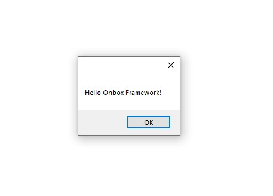

# Commands

Onbox have two main Revit Command implementations:
- `RevitContainerCommand` - An indepentend command that will instantiate its own container.
- `RevitAppCommand` - A Command that will hook itself to an Application and use a scoped version of its container.

## Exploring "HelloCommand"

1. For this tutorial, we are focusing on the later. Double click on **HelloCommand.cs** under **Revit->Commands** folder on Visual Studio. 

Again we find some similarities between regular Revit API programming, this looks almost exactly like a `IRevitExternalCommand`:

``` C#
    [Transaction(TransactionMode.Manual)]
    public class HelloCommand : RevitAppCommand<App>
    {
        public override Result Execute(IContainerResolver container, ExternalCommandData commandData, ref string message, ElementSet elements)
        {
            // Asks the container for a new instance a message service
            var messageService = container.Resolve<IMessageService>();
            messageService.Show("Hello Onbox Framework!");

            return Result.Succeeded;
        }
    }
```
Notice that it derives from RevitAppCommand passing in our app type as its parent application. As stated before, this hooks IOC Container from the app to the command and any type registered on `App.Startup` will be available here through the injected `IContainerResolver` argument.

Other benefits to maintain a strongly typed relationship between a command and its app is that makes it easier to refactor or navigate back and forth during development.

``container.Resolve<IMessageService>`` asks the container for a new instance of IMessageService interface, the container knows how to instantiate this service because it has been registered on ``App.Startup``. Remember when we were exploring this method, we saw that this template comes with ``MessageBoxService`` type registered as a ``IMessageService``? The clever part of inversion of control is if we want to change the implementation of this service, it is just of matter of changing the registration on ``App.Startup``, not in potentially hundreds or thousands places that is used on a large scale project.

Here is the dialog that shows when you click on **"Hello Framework"** in the Ribbon.



## Conclusion

The basic idea behind what we saw until now is register and resolve, we first tell the container about the abstractions and implementations we will be using during our application's lifetime. The container will then take the responsability of instantiating these types for us, making the application easier to code, debug, refactor, test and much more!

Okay, lets talk a bit about [WPF Views and MVC](1_3_views_mvc.md) now.