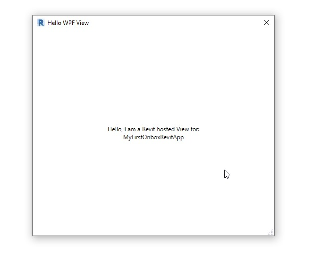

# Getting Started - Creating your first app

On this getting started guide we will help you explore how to create a simple Revit Application using Onbox framework, we will launch the app and explore its main components while showing you some the main concepts and how it differs from regular Revit API programming.

This guide assumes that you have installed:
 - Revit >= 2019
 - .NetStandard >= 2.0
 - .Net Framework >= 4.7.2
 - Visual Studio 2019

## Download Visual Studio Templates

Click [here](https://github.com/engthiago/Onboxframework.docs/releases) to download the templates for the version of the framwork you are using.

## Install the Templates

1. First, make sure Visual Studio is not running, then unzip the contents on *%userprofile%\Documents\Visual Studio 2019* folder.

2. The resulting folder structure will be something like this for the ProjectTemplates folder:

## Launch Visual Studio

3. Launch Visual Studio and click on **"Create a new project"**

4. On Platform drop down menu, choose Revit and then pick **"Onbox MVC - APP"**

5. Type your project name and click **"Create"**

## Launch your App

> ⚠️ **Heads Up:** Sometimes Visual Studio will complain when you try to build the solution for the first time, this happens, apperently because of a bug on PropertyChanged.Fody when referenced by Nuget. If you get build errors in the next step, click on Build -> Clean Solution and try to Run the Solution again. Once the packages are downloaded you should not have this issue anymore.

1. This step also assumes that your Revit is installed on the default C:/Program Files/ Revit folder, if not, please change this patch on Visual Studio: Project Properties -> Debug tab.

2. Choose a Revit Version on the Solution Configuration Drop down menu and hit **"Start"**

3. Accept the loading of the Addin:

4. After Launching Revit, open or create a project and you will see a new Ribbon tab with two buttons:

5. Clicking in the button **"Hello WPF"** this dialog will pop up:

# Conclusion

Congratulations! ou have your first application up and running, now it is time to dive deeper and undestand what is going on on the background. Click [here](1_1_application.md) to continue this tutorial.
   