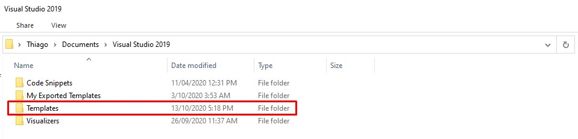
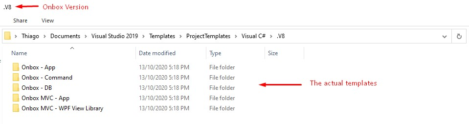
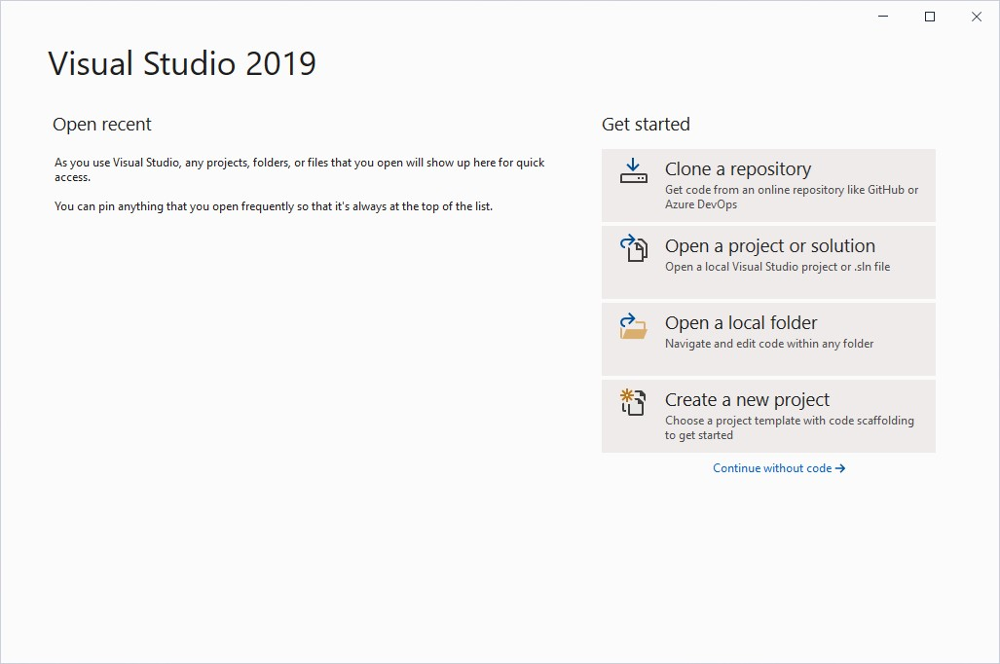
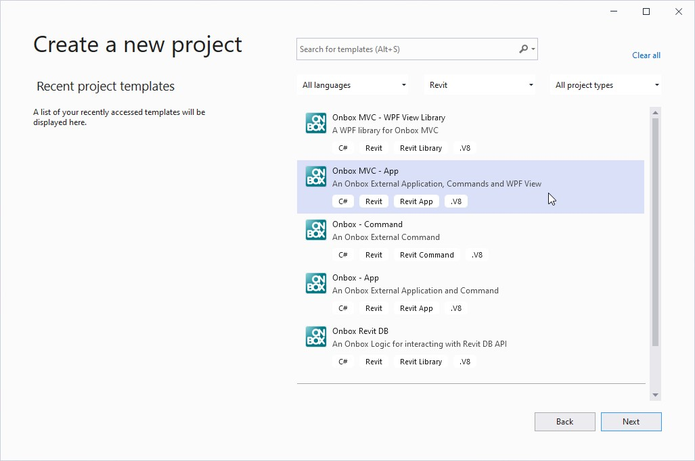
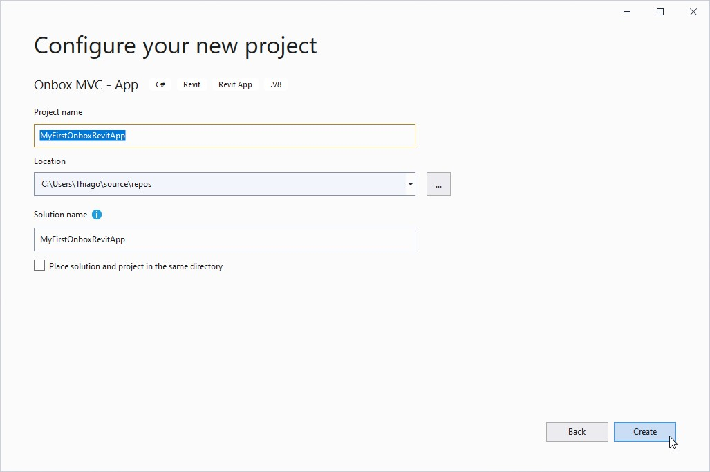
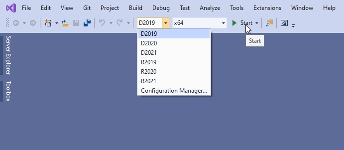
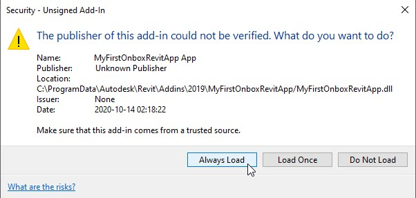
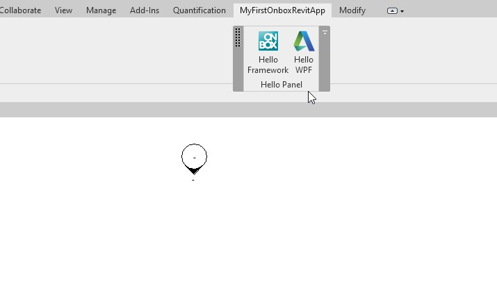

# Getting Started

This guide assumes that you have installed:
 - Revit >= 2019
 - .NetStandard >= 2.0
 - .Net Framework >= 4.7.2
 - Visual Studio 2019

## Download Visual Studio Templates

Click here to download the templates

## Install the Templates

> First, make sure Visual Studio is not running, then unzip the contents on *%userprofile%\Documents\Visual Studio 2019* folder.

> The resulting folder structure will be something like this for the ProjectTemplates folder:

## Launch Visual Studio

> Launch Visual Studio and click on **"Create a new project"**

> On Platform drop down menu, choose Revit and then pick **"Onbox MVC - APP"**

> Type your project name and click **"Create"**

## Launch your App

> Sometimes Visual Studio will complain when you try to build the solution for the first time, this happens, apperently because of a bug on PropertyChanged.Fody when referenced by Nuget. If you get build errors in the next step, click on Build -> Clean Solution and try to Run the Solution again. Once the packages are downloaded you should not have this issue anymore.

> This step also assumes that your Revit is installed on the default C:/Program Files/ Revit folder, if not, please change this patch on Visual Studio: Project Properties -> Debug tab.

> Choose a Revit Version on the Solution Configuration Drop down menu and hit **"Start"**

> Accept the loading of the Addin:

> After Launching Revit, open or create a project and you will see a new Ribbon tab with two buttons:

